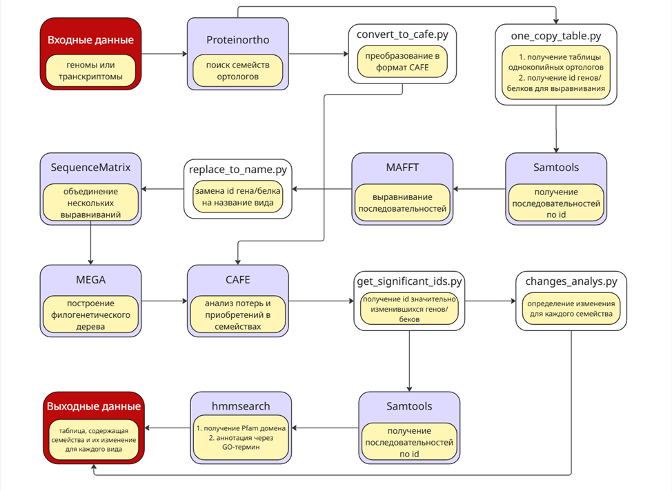

#Gains_and_losses_founder

This project contains scripts on Python that were used in a pipeline for searchin for gains and losses genes in the genomes of intracellular parasites.

#How to use

Scripts must be run on the command line as part of a pipeline